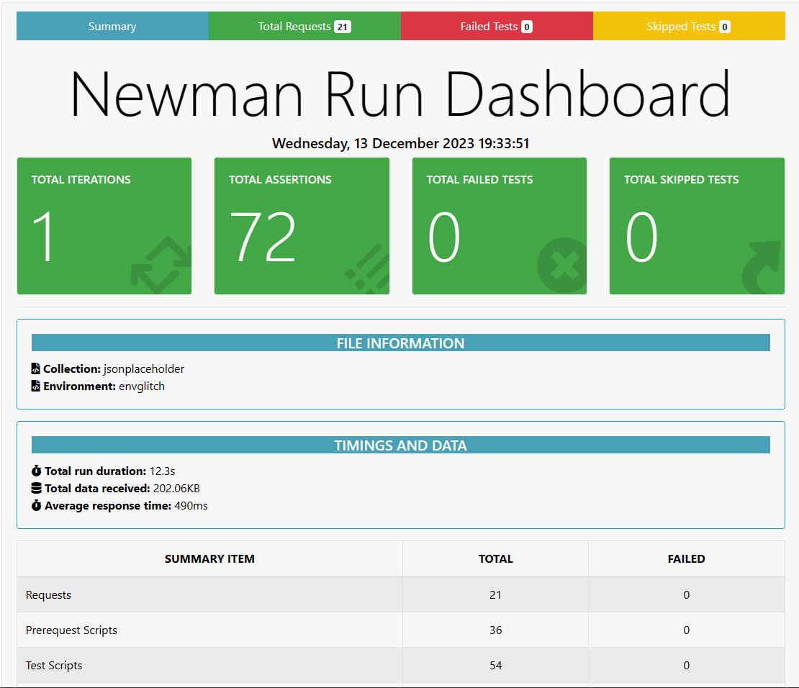
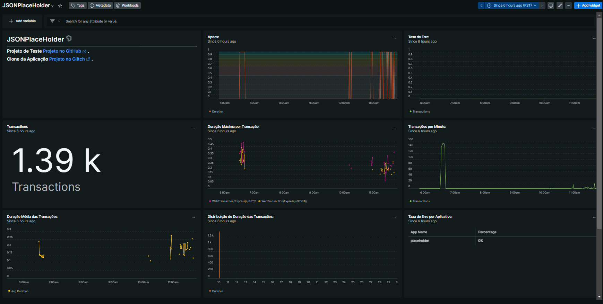

# QA Automation Challenge


Bem-vindo! Este projeto realiza testes automatizados na API https://jsonplaceholder.typicode.com/.

Foi Criado uma collection no Postman passando dados Randomicos, realizando todas as chamadas POST e GET da API do [{JSON} PlaceHolder](https://jsonplaceholder.typicode.com/) , Nos testes realizados busquei o aproveitamento do codigo colocando na ```Folder``` de cada suite dados que podem ser reaproveitados nos testes da mesma.

Realizei uma abordagem com teste de contrato ```Schema``` Ultizando ```TV4``` onde é possivel em uma unica estrutura validar tipo de dado, formato do dado e obrigatoriedade em contrato. Foram encontrados 2 tipos de contrato para estas requisições a mesma tras a estrura  de ```Array de objetos``` para multiplos resultados e ```objeto``` para resultados unicos.

Foi Realizado tambem a validação da inserção de registro realizando um  ```SendRequest``` que faz um GET por id apos um POST ser executado.

## Instalação

```
npm install -g newman
npm install -g newman-reporter-htmlextra
newman run jsonplaceholder.postman_collection.json -e envcase.postman_environment.json --reporters='cli,htmlextra'
 ```

---

# Continuous Testing and Observability  


Finalizando os testes foi criado uma ```pipeLine``` com ```GitHub actions``` para execução dos testes e geração de report.

Foi criado tambem um clone da aplicação no [Glitch](https://magnetic-aquamarine-cockroach.glitch.me/) onde foi instrumentada a observabilidade com a ferramenta [NewRelic](https://onenr.io/0bRK64xeDwE)






---


### Projeto de Teste [Projeto no GitHub](https://github.com/ferpioli/test-jsonplaceholder).
### Workflow do Projeto [Pipeline GitHub Actions](https://github.com/ferpioli/test-jsonplaceholder/actions).
### Clone da Aplicação [Projeto no Glitch](https://magnetic-aquamarine-cockroach.glitch.me/).
### Instrumentação para observabilidade [Dashboard NewRelic](https://onenr.io/00jlm0JnOQW).


